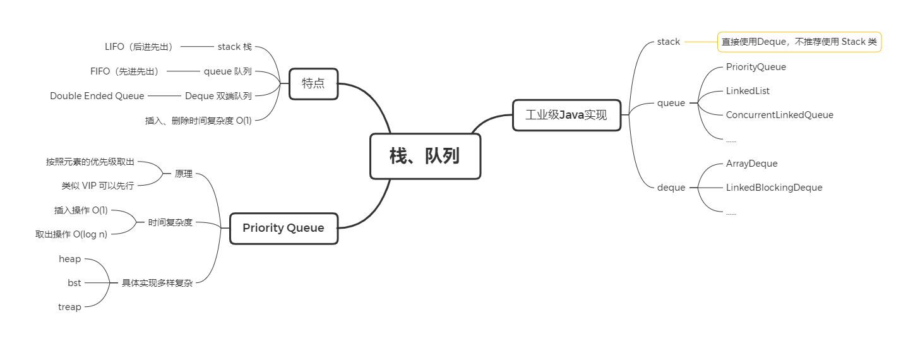

# 学习笔记

> 最需要总结的笔记：
> 1. 老师布置的软作业，比如读源码，脑图
> 2. 有不懂或者疑惑的问题，在这里提出来
> 3. 针对一周的学习情况，总结自己哪里做的好，哪里做的不足，下周有针对性地改进
> 4. 相同类型的题目，或者相同类型的解题思路，在这里总结
> 5. 重点题目，在这里记录详细思路和解法，不要求贴代码
> 6. 其他

**300 题 / 10 周 ~= 4 题 / 1 天**

[--> 图片加载不出来看这里](https://blog.csdn.net/outman_1921/article/details/106595472)

___

## [算法与数据结构总览.md](markdown/算法与数据结构总览.md)

1.高效学习算法

[如何高效学习算法.md](markdown/如何高效学习算法.md)

2.算法与数据结构总览

[时间空间复杂度.md](markdown/时间空间复杂度.md)

3.时空复杂度

[算法与数据结构总览.md](markdown/算法与数据结构总览.md)

4.数组_链表_跳表

[数组链表跳表.md](markdown/数组链表跳表.md)

5.栈_队列

[栈队列.md](markdown/栈队列.md)

## 三省吾身

第一周过去了，和大家一样都很兴奋，每天看视频、刷题、看题解，反反复复。虽然才7天，但二刷三刷题目的时候，明显感觉到思路能很快街上了，而且代码写起来也比较顺了。简要记录一下：

* 经验
1. 每日刷题跟上节奏，重要的是习惯养成；
2. Day1 看所有视频（第一遍），Day2~7 刷题；
3. 刷题遍数保持的不错，但还应该按照时间规律（客观认识记忆曲线）；
4. 脑图学习法能够帮我建立 semantic tree；
5. 5分钟没思路，或者10分钟写不出来，直接看高票题解，默写优质代码。

* 教训
1. 没有严格按照五毒神掌的时间规律刷题；
2. 源码分析没有及时跟上；
3. 第一周做了很多简单题，下周应该多做中等和困难题；
4. 周末两天做总结，否则很多软作业无法按时按质完成。

## 参考链接
1. [Java 的 PriorityQueue 文档](https://docs.oracle.com/javase/10/docs/api/java/util/PriorityQueue.html)
2. [Java 的 Stack 源码](http://developer.classpath.org/doc/java/util/Stack-source.html)
3. [Java 的 Queue 源码](http://fuseyism.com/classpath/doc/java/util/Queue-source.html)
4. [Python 的 heapq](https://docs.python.org/2/library/heapq.html); 
5. [高性能的 container 库](https://docs.python.org/2/library/collections.html); 
6. [Java 源码分析（ArrayList）](http://developer.classpath.org/doc/java/util/ArrayList-source.html)
7. [Linked List 的标准实现代码](https://www.geeksforgeeks.org/implementing-a-linked-list-in-java-using-class/)
8. [Linked List 示例代码](http://www.cs.cmu.edu/~adamchik/15-121/lectures/Linked%20Lists/code/LinkedList.java)
9. [Java 源码分析（LinkedList）](http://developer.classpath.org/doc/java/util/LinkedList-source.html)
10. [LRU Cache - Linked list： LRU 缓存机制](http://leetcode-cn.com/problems/lru-cache)
11. [Redis - Skip List：跳跃表、为啥 Redis 使用跳表（Skip List）而不是使用 Red-Black？](http://www.zhihu.com/question/20202931)

——————————

*兴奋 -> 彷徨 -> 坚持 -> OFFER!!!*
