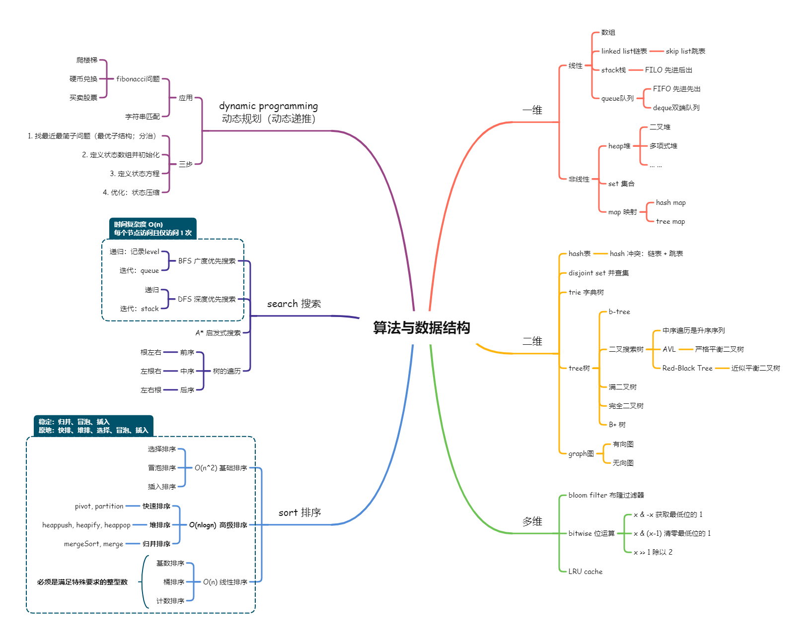

# 学习笔记 - 毕业总结

## 一、心得体会

首先为自己能坚持到最后鼓鼓掌，这是意料之中也是意料之外的！以前学习其他网课，曾因为赶不上进度而掉队，或因为失去兴趣而中途放弃，所以开始算法训练营学习的第一天我就清楚地告诉自己这一次一定要坚持下来！（虽然这种flag不知立过多少次）下学期刚开始的时候曾有一段时间工作项目非常紧张精力有限，数次到晚上12点才写完当天的题和总结。这样慢慢地，越到后来就越不忍放弃，不然都对不住自己曾经熬过的那些夜。当然，课程设计的合理性以及微信群的打卡交流作用也是我能坚持到最后的强有力后盾，感谢 GeekTime & QinChao！

说起意料之外，这门课带给我的绝不仅仅是计算机算法的实战训练，更重要地是给我指明了方向：如何从业余到职业顶尖水准，如何利用全世界的互联网资源从各路大神那里取长补短，如何从无到有构建自己的知识体系。真正做到了授之以渔！有道无术可生术，有术无道止于术。

### 1. 五毒神掌

这门课最最重要的内功心法 —— 过遍数！过遍数！过遍数！

只有尊重人脑记忆曲线的客观事实规律，才能有的放矢提高自己的记忆精度，才有之后的理解深度。所谓五毒神掌，就是说要对自己的薄弱环节刻意练习，而且要多次刻意练习，次与次之间需要一定时间间隔。在算法训练阶段，不放按照超哥的提示做：

> - 第 1 遍：不要死磕，要看代码学习（一定要看国际版高票回答，不要懒）
> - 第 2 遍：自己写（理解后默写、调试直到AC）
> - 第 3 遍：24小时后
> - 第 4 遍：一周后 
> - 第 5 遍：面试前

### 2. **树**形思考

课上曾讲到过现实版钢铁侠马斯克对网友提问“为什么你能掌握那么多知识”的回答。他说，人脑不太善于记忆那些孤立的知识点，要熟练掌握一个比较复杂的领域，需要构建一个知识树，把这个领域内的知识点串联起来。

这个方法确实在很多实践中得到验证，比如单词词根记忆法、联想记忆法，以及所谓的举一反三。因此，学习算法的过程中，不能只一道道刷题而不管（或者懒于）将本质相同或相似的问题串联起来，比如爬楼梯、硬币兑换、0-1背包等等。

脑图，作为一个工具，正好完美切合这种思考方式，值得经常使用。君子性非异也，善假于物也！

### 3. 向高手学习

有时候做题比较累，但越累越应该高兴，因为我终于熬过了打小怪升级的阶段，挑战小boss从而让自己有可能升一个level，从星耀到王者。国内站的一些题解写得不错，不一定是官方的。国际站的高票回复经常有神来之笔，原来可以这么玩！吊炸天！

学习的过程不会总是愉快的，一定会有起伏、烦躁、失落，甚至可能怀疑自己。You fall, you stand up. It's simple but it's not easy.不断给自己打气，坚持到最后，就一定能成功。

 

## 二、知识梳理

[算法与数据结构.md](./xmind/算法与数据结构.md)

