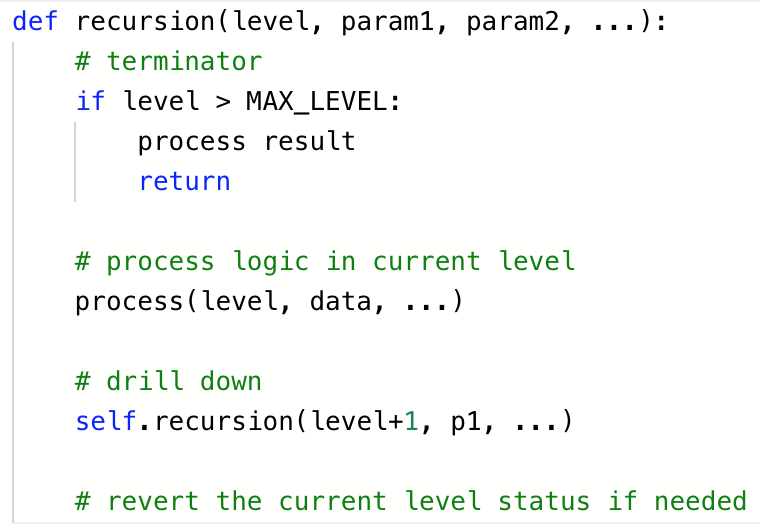
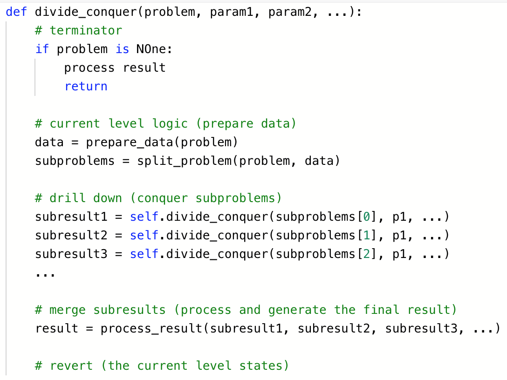

# 学习笔记 / Week03

|Time|Version|Note|
|---|---|---|
|08/10|0.0.1|draft|

 

> 尝试一下每天都写点总结，知识的积累是个循序渐进、不断反复的过程。
> 
—— week3 小理解

[--> 图片加载不出来看这里](https://blog.csdn.net/outman_1921/article/details/106595472)

 

## 递归分治回溯 / 本质

- 算法最终都会转化成 if-else、loop、recursion

- 通过函数调用自己来进行循环

- 代码最底层汇编：反复跳到某一段代码执行

 

## 实际项目 / 核心

1. 怎样分解子问题？
2. 如何保证中间子结果的质量？
3. 怎样 merge 子问题结果？
4. 只考虑当前层，不要下探

 

## 三个思维要点

### 1. 抵制人肉递归

最大误区！！！

一定要主动抛弃人肉进行递归的“坏”习惯！直接看函数写即可。否则永远无法熟练使用递归！

### 2. 找最近重复子问题

**找到最近最简的方法，将其拆解成可重复解决的问题**

### 3. 数学归纳法思维

初始条件成立，如 n=1, n=2 时；且当 n 成立时，能推导出 n+1 也成立。

 

## Recursion 递归

### 步骤

1. terminator / 递归终止条件
 
    终止条件：到了叶子结点，子问题没有了

2. current level logic / 处理当前层逻辑 
3. drill down / 下探到下一层
4. revert / 清理当前层（非必须）

### 代码

 

## Divide & Conquer 分治

### 步骤

1. terminator
2. current level logic
3. drill down
4. merge subresults
5. revert

### 代码

 

## Backtracking 回溯

### 典型案例

- 八皇后、数独、括号生成
