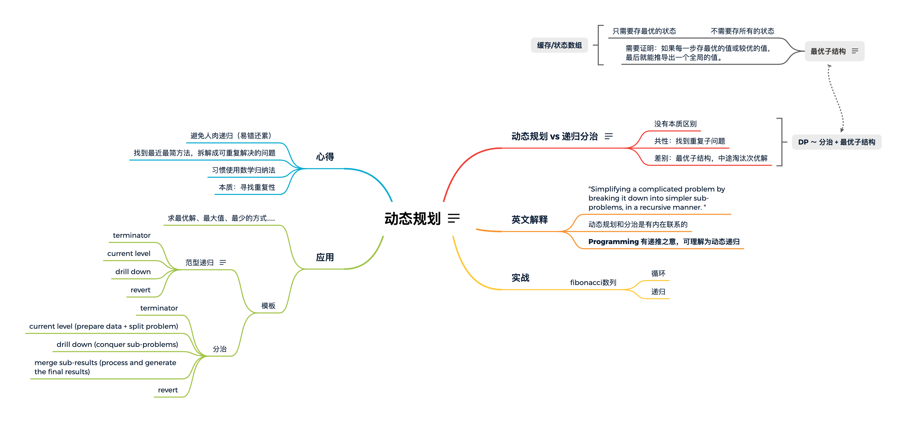

# 学习笔记 / Week06

|Time|Version|Note|
|---|---|---|
|09/02|0.0.1|draft|

 

> Dynamic Programming
> 
—— week6 动态“递推”

 

### DP 之 字符串匹配
【todo】

### DP vs 分治（带记忆）
【todo】

### 从TextCNN想到的基础算法

最近在做图像和NLP相关的深度学习工作，接触到了TextCNN。在仔细研究完原理之后，对作者的思路肃然起敬，原来可以这么想！在研究开源代码时，仔细咀嚼一些特殊的处理，很兴奋，因为正是这段时间算法学习的成果。简单分享一下。

1.TextCNN 原理：从图像到文字
【todo】

2.Embedding 矩阵：为什么不用 hash map？
【todo】

3.Image Embedding：为什么不和 NLP 一样造个 vocabulary（词库）？
【todo】

### DP脑图

